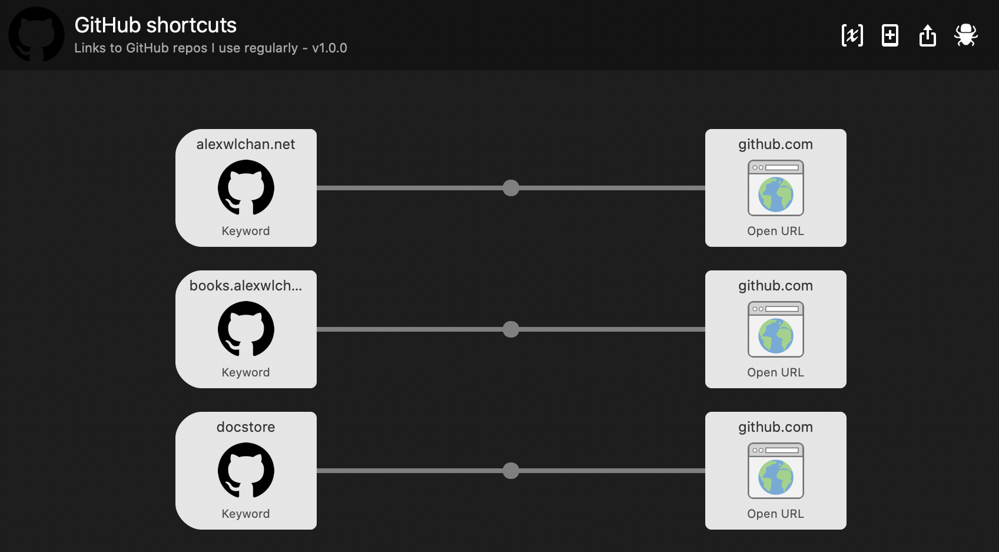

# github_alfred_shortcuts

This is a script to help me create an [Alfred Workflow] that links to GitHub repositories that I use regularly.



I do this with a custom workflow, rather than the built-in web search/bookmark features for two reasons:

*   I want to search a lot of repos this way, and it's easier to write a workflow-building script than point-and-click in the GUI.
*   I want GitHub shortcuts on both my personal and work computers, but I have no way to automatically sync my Alfred settings between them.
    Having a workflow I can build separately on each machine (and with different config) allows me to keep them consistent.

[Alfred Workflow]: https://www.alfredapp.com/workflows/


## Usage

If you want to use this script yourself, you'll need Python installed.

Clone this repo, update the list of repos in `repos.ini`, then run the script:

```
$ python3 create_workflow.py
```

This will create a package `github_shortcuts.alfredworkflow` in the repo; open this to get the shortcut.


## Config syntax

This is an example of the repo config:

```
[repos]
alexwlchan =
    docstore
    dominant_colours
    pathscripts

wellcomecollection  =
    wellcomecollection.org (dotorg)

    storage-service

scanamo =
    scanamo
```

The GitHub owner is the top-level key, then put one repo per line.
You can put in empty lines to organise the list.

By default, the shortcut will trigger for the name of the repo (e.g. `docstore`).
You can override the shortcut by putting an alternative name in brackets (e.g. `(dotorg)`).
